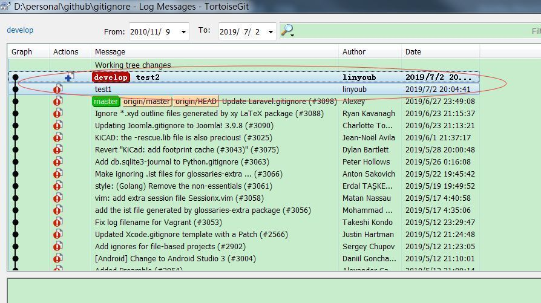
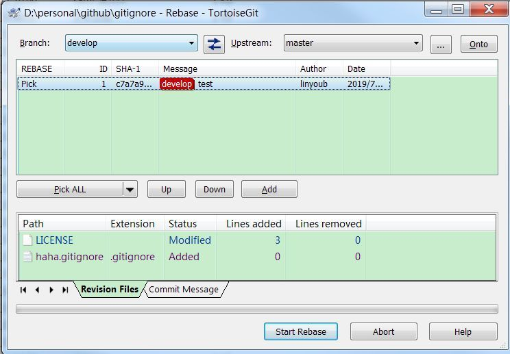

# 开发流程 #

## 克隆私人仓库 ##
``` shell
git clone git@github.com:linyoubin/gitignore.git
```

## 添加远程官方仓库 ##
``` shell
git remote add offical git@github.com:github/gitignore.git
```

``` shell
git remote -vv
offical git@github.com:github/gitignore.git (fetch)
offical git@github.com:github/gitignore.git (push)
origin  git@github.com:linyoubin/gitignore.git (fetch)
origin  git@github.com:linyoubin/gitignore.git (push)
```

## 新建本地开发分支 develop ##
``` shell
git checkout -b develop origin/master
```

## 修改代码 ##
修改代码，并且有多次 commit 记录。 期间不能 git pull 官方或个人仓库

## 合并开发分支多个 commit ##
可以任意选择以下两种方式中的一种进行操作

### TortoiseGit 操作 ###
show log 

选择需要合并的多个 commit

右键选择combine to one commit



### Git 操作 ###

查看本分支提交记录
``` shell
git log 
commit bc335b3a500d0ad35a6278e8d763096175b324a6 (HEAD -> develop)
Author: linyoub <linyoub@163.com>
Date:   Tue Jul 2 20:05:02 2019 +0800

    test2

commit c4be3a2e737ce171639b420446d2e237bd98fdd3
Author: linyoub <linyoub@163.com>
Date:   Tue Jul 2 20:04:41 2019 +0800

    test1

commit 50e42aa1064d004a5c99eaa72a2d8054a0d8de55 (origin/master, origin/HEAD, master)
Author: Alexey <alexey.khachatryan@gmail.com>
Date:   Thu Jun 27 19:49:08 2019 +0400

    Update Laravel.gitignore (#3098)

```

指定将前两次 commit 合并成一次提交 (50e42aa1064d004a5c99eaa72a2d8054a0d8de55 为第三个 commit 的 hash )
``` shell
git rebase -i 50e42aa1064d004a5c99eaa72a2d8054a0d8de55
```

编辑选择第一个 pick，第二个 s 进行合并
编辑 log

``` shell
git log
commit c7a7a93252013545839ca12235b7fb0094958767 (HEAD -> develop)
Author: linyoub <linyoub@163.com>
Date:   Tue Jul 2 20:04:41 2019 +0800

    test

commit 50e42aa1064d004a5c99eaa72a2d8054a0d8de55 (origin/master, origin/HEAD, master)
Author: Alexey <alexey.khachatryan@gmail.com>
Date:   Thu Jun 27 19:49:08 2019 +0400

    Update Laravel.gitignore (#3098)

```

可以看到之前的两次提交被合并成一次提交

combine to one commit

## 更新官方最新代码到本地 master ##
``` shell
git checkout master
git pull offical master
```

## 合并本地 master 分支到本地 develop 分支 ##
可以任意选择以下两种方式中的一种进行操作

### 使用 TortoiseGit ###
checkout develop

rebase

右边选择 master 本地分支

start rebase



期间可能需要解决冲突，冲突解决完之后，继续 rebase

>**Note:** 如果 master 分支没有修改时，会提示不需要 rebase。此时可以直接结束
>

### 使用 Git ###

``` shell
git checkout develop
git rebase master
```

期间可能需要解决冲突，冲突解决完之后，继续 rebase
``` shell
git rebase --continue
```

## 推送本地 develop 分支为远程 develop 分支 ##
``` shell
git push origin develop
```

## 从远程 develop分支请求 pull request 到远程官方仓库 ##
在网页上发起 pull request

## 官方库同意并提交 pull request 之后删除远程分支 ##
``` shell
git checkout master
git branch -D develop
git push origin --delete develop
```
