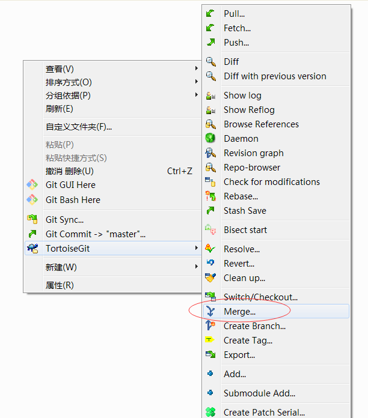

# 基本操作 #

## git bash ##
[git 安装](tool/git.md)之后自带了 git bash。 git bash 是一个类似于 Linux shell 的命令行窗口。可以方便地使用 git 命令进行项目的 clone, commit 等操作。

在文件浏览窗口鼠标右键-->Git Bash Here， 打开 git bash。以下命令行命令没有特殊说明的，均是在 git bash 中的操作。

### git clone ###
拷贝一个 Git 仓库到本地，让自己能够查看、修改、提交该项目。

``` shell
$ git clone git@github.com:yourname/yourrepository.git
```

>**Note:**
>
> git@github.com:yourname/yourrepository.git 为你在 github 上拥有的仓库路径。其中 yourname 为用户名，yourrepository 为仓库名
>
> 该命令会在当前目录下创建 git 本地仓库，目录名称为仓库名
>

### git add ###

### git status ###

### git commit ###

### 指定某个版本创建分支 ###

+ 以当前 master 主分支的代码创建本地分支 test，并同时切换到 test 分支
   ``` shell
   $ git checkout -b test
   ```

+ 将当前 test 分支回退到某个版本

   获取更新 log 
   ``` shell
   $ git log
   commit 1a2db539e6e4966caa8badb044db9d5297f8a800
   ...
   commit 828c977682ecdf45eb7eec0721183811752eecfe
   ...
   ```

   选择需要回退的版本，并将当前 test 分支回退到指定版本
   ``` shell
   $ git reset --hard 828c977682ecdf45eb7eec0721183811752eecfe
   ```

+ 后续则可以在 test 分支上进行代码编写
   
   切换到 test 分支
   ```
   $ git checkout test
   ```

+ test 分支代码编写完毕后，执行合并提交

   切换回 master 分支
   ```
   $ git checkout master
   ```

   在仓库目录内，鼠标右键 TortoiseGit-->Merge，选择从需要合并的源 Branch 

   

   存在冲突时，鼠标右键冲突文件 TortoiseGit-->edit conflicts

### ###