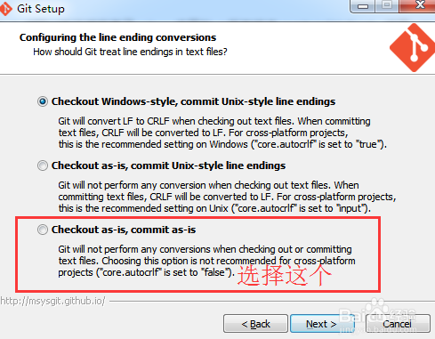

# Git #

## 下载地址 ##

官网下载地址：https://git-scm.com

腾讯下载地址：https://pc.qq.com/detail/13/detail_22693.html

腾讯的链接比较快，官网的速度太慢。

## 安装 ##

windows 下双击可执行程序安装即可。注意安装时选择换行符的规则：


## 配置免密操作 ##

+ 在文件浏览窗口中，右键鼠标打开 Git Bash Here （不用进行你的资源库目录，在外面就行）
+ 使用 ssh-keygen 生成密钥
    ``` shell
    ssh-keygen -t rsa -C "your_email@example.com" 
    ```
    >**Note:**
    >
    >其中 your_email@example.com 为你在 github 的帐户邮箱名

    后面会提示你输入密码
    ```
    Enter passphrase (empty for no passphrase): [Type a passphrase]  
    # Enter same passphrase again: [Type passphrase again] 
    ```

    生成成功之后会给出类似如下提示
    ```
    # Your identification has been saved in /Users/you/.ssh/id_rsa.  
    # Your public key has been saved in /Users/you/.ssh/id_rsa.pub.  
    # The key fingerprint is:  
    # 01:0f:f4:3b:ca:85:d6:17:a1:7d:f0:68:9d:f0:a2:db your_email@example.com
    ```

+ 将公钥填入 github 配置中
  
  github 账号上面：setting-->SSH and GPG keys-->New SSH key
  把id_rsa.pub里面的内容复制到 key 中，title 随便起

+ 验证是否配置成功
   ``` shell
   ssh -T git@github.com
   ```
