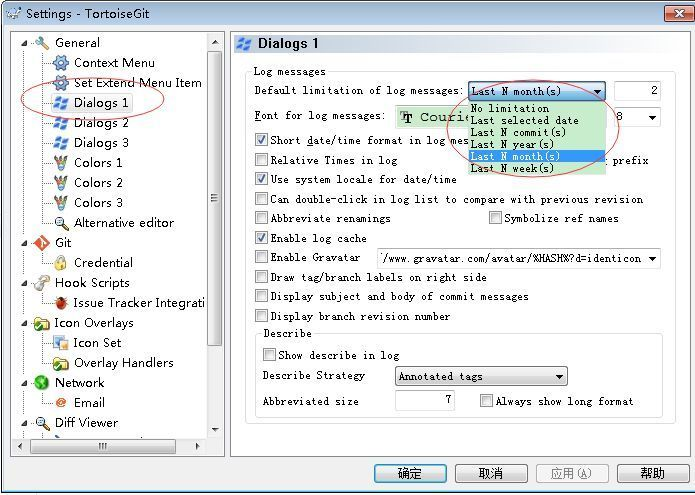
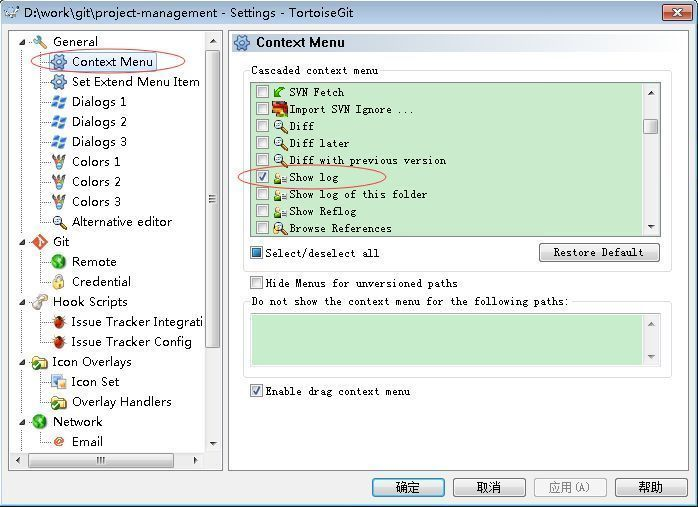
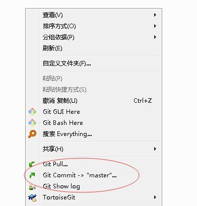

# TortoiseGit #

## 下载地址 ##

官网下载地址：https://tortoisegit.org/download/

## 安装 ##

双击可执行程序，一路 next 即可。

## 配置免密操作 ##
+ 从开始菜单 TortoiseGit 文件夹下打开 puttyGen 

   在 puttyGen 中点击 Generate 生成公钥私钥。
   >**Note:** 生成过程中需要不断移动并点击鼠标以辅助生成足够的随机值。
   > 

+ 将公钥填入 github 配置中
  
  github 账号上面：setting-->SSH and GPG keys-->New SSH key
  把id_rsa.pub里面的内容复制到 key 中，title 随便起

+ 将密钥保存成文件(后缀.ppk)

+ 从开始菜单 TortoiseGit 文件夹下打开 Pageant 

  右键通知区域中的 Pageant 图标 Add Key. 导入密钥文件

+ 验证是否配置成功

  提交一次 github 修改做为验证步骤即可。具体操作参见[基本操作](../../basicop.md)

  ## 推荐配置 ##
  ### 配置log显示条数 ###

  默认情况下会显示所有提交记录，当提交记录太多时 show log 会非常慢。因此可以调整最大显示的提交次数即可。（svn默认是300）

  

  ### 常用命令加入右键菜单 ###
  将经常使用的命令，如 show log, pull 等加入右键菜单，提高效率

  

  效果如下

  
  
  ### 使用beyondcompare作为比较工具 ###
  setting->diff viewer
  setting->diff viewer->merge tool
  修改为 beyongcompare 的执行程序路径
